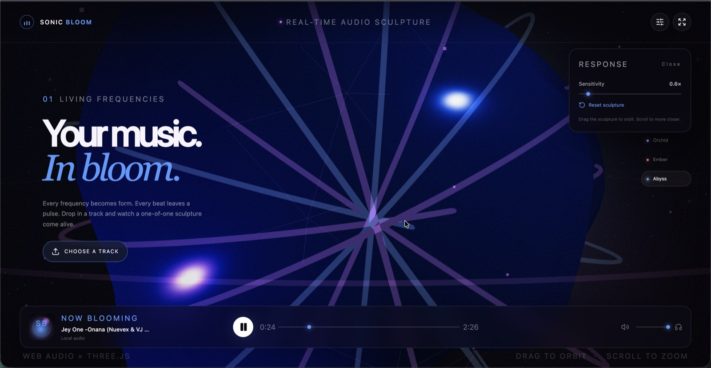

# Sonic Bloom

**Turn any song into a living, real-time 3D sculpture.**

[](https://github.com/agzhxx/sonic-bloom/actions/workflows/ci.yml)
[](LICENSE)
[](https://react.dev/)
[](https://threejs.org/)

## Live demo

**[Launch Sonic Bloom →](https://agzhxx.github.io/sonic-bloom/)**

Sonic Bloom is an immersive browser-based music player that analyzes local audio in real time and transforms it into an evolving 3D bloom. Instead of using conventional equalizer bars, the app maps frequency bands, spectral energy, and musical onsets to a faceted seed, flowing filaments, responsive particles, light, and motion.



## Highlights

- Real-time frequency analysis with the Web Audio API
- Interactive 3D scene powered by React Three Fiber and Three.js
- A closed seed that unfolds into a frequency-driven spectral flower
- Sixteen filaments shaped by individual FFT bins
- Particle shell driven by high-frequency detail
- Onset-aware bass pulses with adaptive thresholding and cooldown
- Orchid, Ember, and Abyss visual moods
- Drag-and-drop support for MP3, WAV, OGG, and other browser-supported audio
- Play, pause, seek, volume, mute, and fullscreen controls
- Mouse/touch orbit, scroll zoom, responsive layouts, and reduced-motion support
- Local-first privacy: uploaded tracks stay in the browser

## Audio-to-visual mapping

| Audio signal | Visual response |
| --- | --- |
| Bass | Core deformation and controlled pulse halos |
| Mids | Filament curl, rotation, and organic movement |
| Treble | Particle size, shimmer, and surface detail |
| Spectral bins | Individual filament length and shape |
| Musical onset | Short beat pulse with a cooldown |
| Playback state | Seed opens while playing and closes when paused |

## Tech stack

- React 19 and TypeScript
- React Three Fiber, Drei, and Three.js
- Web Audio API and `AnalyserNode`
- Tailwind CSS 4 and custom CSS
- Vinext and Vite
- Lucide React icons
- Cloudflare-compatible Sites runtime

## Getting started

### Requirements

- Node.js 22.13 or newer
- A modern browser with WebGL and Web Audio support

### Run locally

```bash
git clone https://github.com/agzhxx/sonic-bloom.git
cd sonic-bloom
npm install
npm run dev
```

Open `http://localhost:3000`, choose an audio file, and press play. You can also drag an audio file directly onto the page.

### Available scripts

```bash
npm run dev      # Start the local development server
npm run build    # Create a production build
npm test         # Build and run rendered-output tests
npm run lint     # Run the lint checks
```

## Controls

| Input | Action |
| --- | --- |
| Choose a track / drag and drop | Load local audio |
| Play button | Play or pause the current track |
| Timeline | Seek through the track |
| Drag the sculpture | Orbit the camera |
| Scroll | Zoom in or out |
| Mood selector | Change the visual palette |
| Settings | Adjust visual sensitivity |
| Fullscreen button | Enter immersive fullscreen mode |

## Privacy

Audio files are loaded through an in-memory object URL and analyzed locally. Sonic Bloom does not upload, save, or transmit the selected track.

## Deployment and CI

GitHub Actions runs the production build and test suite on pushes and pull requests. A separate deployment workflow creates a static browser build and publishes it to GitHub Pages whenever `main` changes.

## Project structure

```text
app/
├── SonicBloom.tsx    # Audio engine, player UI, and 3D scene
├── globals.css       # Responsive visual design
├── layout.tsx        # Metadata and root layout
└── page.tsx          # Main route
tests/                # Rendered-output tests
public/               # Static assets
.github/workflows/    # Continuous integration
```

## Roadmap

- Canvas snapshot and poster export
- Browser-based video recording
- Additional sculpture systems
- Preset sharing through URLs
- Adaptive scene quality controls
- Microphone input mode

## License

Released under the [MIT License](LICENSE).

---

Designed and developed by [Agzhan Batyrbek](https://github.com/agzhxx).
